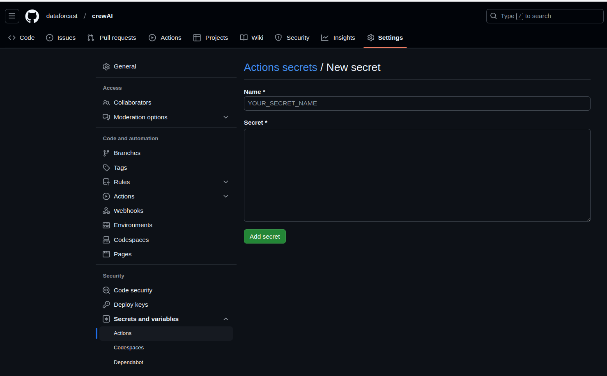
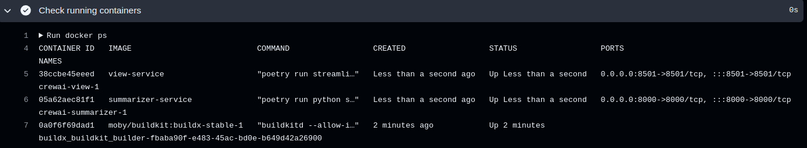

# crewAI
Exemple of migration from agentic towards CrewAI.

The solution has some abilities of a Human Resource assistant.
A (part of ) CV is uploaded and headline, the original text is displayed on letf side 
along with: 
- a headline that provides the global position of the worker
- the historic of experiences
- an abstract of the carreer 


# Components for solution

- **Streamlit** for User Interface : https://docs.streamlit.io/
- **CrewAI** for agents framework : https://docs.crewai.com/
- **OpenAI** for LLMs: https://openai.com/
- **Excalidraw** for schemas and diagrams : https://excalidraw.com/
- **Linkedin** : https://www.linkedin.com/in/françois-bangui-809367151

# Architecture


This application run a multi-container application implemented as two microservices:
- view-service
- summarizer-service

For the need of the Continuous Integration workflow, The OpenAPI API key for querying LLM 
is stored in the Github vault connected to th repository and injected in `resume-service`.

## The View service
User interface implemented with `streamlit`. It allows a user to 
upload a file and view the result.
Supported uploaded file as a .text format.

## The Summarizer service
Two agents are implemented with `crewai` framework.
The first one make an abstract from a CV
The second convert textual period of times into a formated period of times.

# Project files organization


# Configuration
Each service get its own configuration.
The `summarizer` service uses agents that invoke LLMs for accomplishing their tasks.
LLM keys has to be defined into `crewai/summarizer/.env` file:
```
MODEL=gpt-4o
OPENAI_API_KEY=<TO_BE_ASSIGNED>
```
For OpenAI, access API keys from :
> https://platform.openai.com/settings/organization/api-keys

# Secrets management
The `OPENAI_API_KEY` value is a secret intended to be used by authorized persons only.
The use of `crewai/summarizer/.env` file as kye placeholder is relevant for local tests.
Without this key, the building of Docker images can't take place.

For using a rutime key in the Github environment, a secret attached to the repository has to be defined 
in order a local .env file to be built with the assigned key.

Runtime key management is taken into account in the file `crewai/docker-compose.yaml` with instructions:
>     environment:
>      - OPENAI_API_KEY=${OPENAI_API_KEY}

And in workflow file` .github/workflows/build.yml ` with the followings instructions:
>
>       - name: Create .env file for summarizer
>        run: echo "OPENAI_API_KEY=${{ secrets.OPENAI_API_KEY }}" > summarizer/.env


Attaching a secret to the `crewai` repository is achieved from Github Actions as following
> 
> Github repository -> Settings -> Secrets and variables -> Actions
> 
> Click on "New repository secret"
> 
> Use `OPENAI_API_KEY` for secret name
> Assign the value retrieved from OpenAPI platform for API key.
> 

> 

# Managing services
## Building services
> docker compose build
## Launching services
> docker compose up -d

## Stop services
> docker compose down

## Halting services
> docker compose down
For deleting containers without removing images 
## Managing a unique service
`cd .../crewai`

### Managing view service
> docker compose build view

> docker compose up -d view

> docker compose stop view

> docker compose down view
 
### Managing summarizer service
> docker compose build summarizer

> docker compose up -d summarizer

> docker compose stop summarizer

> docker compose down summarizer
# Tests
Once containers are launched and executed with Docker then file into `data/input.txt` may 
be used.

# The continuous integration workflow
The workflow for continuous integration is defined in file `crewai/.github/workflows/build.yml`

All the steps for installing building and checking containers are defined in it.

The workflow is triggered each time a push command on master repository branch is made.

On success on Github Actions page, the following section name "`Check running containers`" should display followings:

# Result
The screen below shows the result of interactions between the two services. 
The left side is the original text.
The right side shows the result.


# Github access
> https://github.com/dataforcast/crewAI