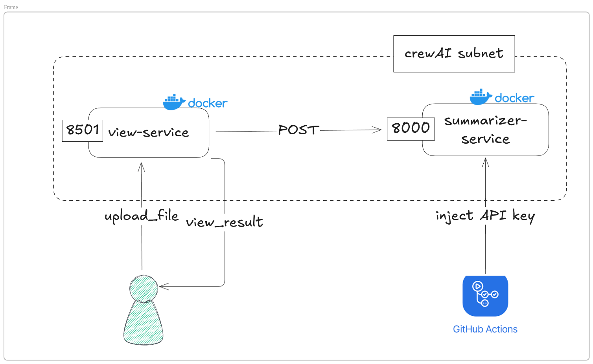
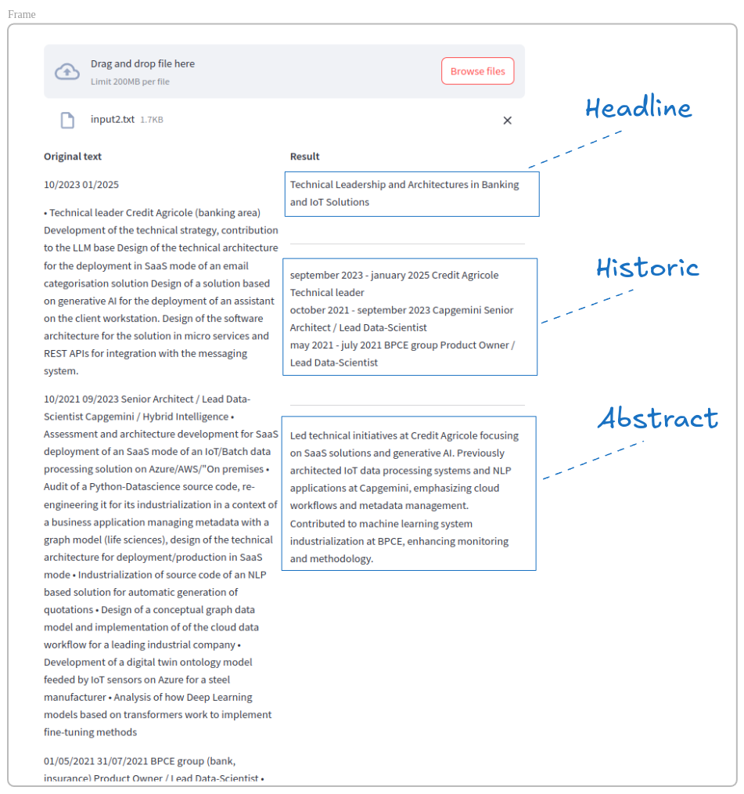
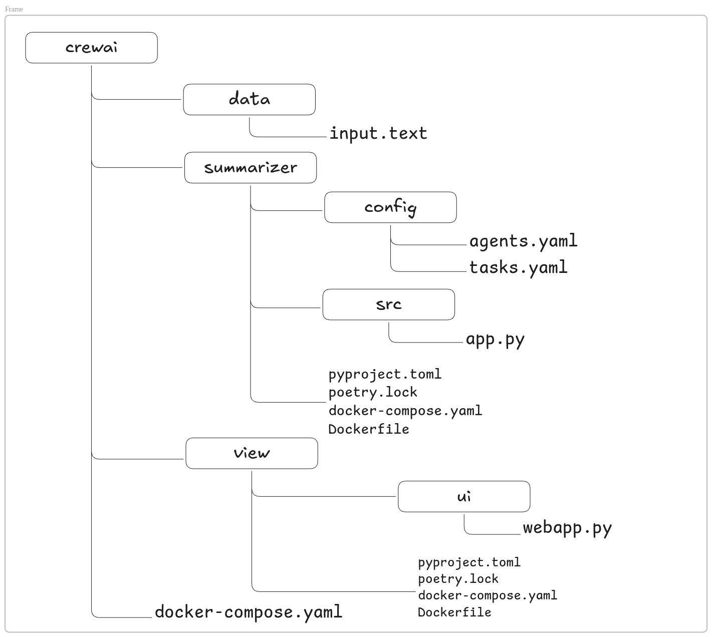

# crewAI
Exemple of migration from agentic towards CrewAI 

# Architecture

This application run a multi-container application implemented as two microservices:
- view-service
- summarizer-service
## The View service
User interface implemented with `streamlit`. It allows a user to 
upload a file and view the result.
Supported uploaded file as a .text format.

## The Summarizer service
Two agents are implemented with `crewai` framework.
The first one make an abstract from a CV
The second convert textual period of times into a formated priod of times.

# Result
The screen below shows the result of interactions between the two services. 
The left side is the original text.
The right side shows the result.

# Project files organization

# Managing services
## Building srevices
> docker compose build
## Launching services
> docker compose up -d

## Stop services
> docker compose down

## Halting services
> docker compose down
For deleting containers without removing images 
## Managing a unique service
`cd .../crewai`

### Managing view service
> docker compose build view

> docker compose up -d view

> docker compose stop view

> docker compose down view
 
### Managing summarizer service
> docker compose build summarizer

> docker compose up -d summarizer

> docker compose stop summarizer

> docker compose down summarizer
# Tests
Once containers are launched and executed with Docker then file into `data/input.txt` may 
be used.